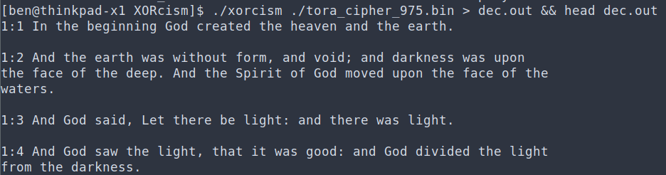
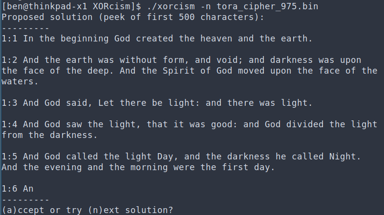

# 0. Introduction

## 0.0 The Pitch

XORcism is a FOSS command-line tool that breaks "rotating xor" style ciphers. It is written in [Rust](https://www.rust-lang.org/), with a moderate emphasis on test cases, parallelism, running time and memory efficiency. XORcism takes about 6 seconds on a standard laptop to decrypt a bible that's been encrypted with a 975-byte key, which you're invited to try for yourself (`xorcism tora_cipher_975.bin`).  

Xorcism can operate in two modes:

1. Simple, non-interactive mode (the default)


2. Interactive mode that proposes multiple solutions, in decreasing order of likelihood


Xorcism supports both xor and modulo-2^32-addition based encryption. Support for modulo-947 multiplication can easily be added, if that sort of thing ever becomes popular. 

### Usage

Basic CLI usage is simple and blunt: `xorcism <INPUT_FILE>` will print the most likely decryption to stdout.

To use xorcism as an external crate in your own project, decide if you trust this repository, and if you do then add the following under `[dependencies]` in your `Cargo.toml`:

```toml
xorcism = { git = "https://github.com/BenH11235/XORcism.git"}
```

Then you can do, for example:

```rust
extern crate xorcism;

use xorcism::crypto::vigenere::{encrypt,decrypt};
use xorcism::utils::xor;
fn main() {
    let pt = b"HELLOWORLD";
    let key = b"key";
    let ct = encrypt(pt,key,&xor);
    let pt2 = decrypt(&ct,key,&xor);
    println!("{}",String::from_utf8_lossy(&pt2));
}
```

Note that this project has not yet been updated to support newer Rust editions, so opt out by deleting the appropriate line from your `Cargo.toml`.

## 0.1 The Anti-Pitch

XORcism solves a long-solved entry-level cryptographic problem. This is a problem you're introduced to in lecture 3 of crypto 101, and for which you could probably get a serviceable solution by running a Google search for "Vigenère cipher decryptor", clicking "view source" on the first result and making some minor modifications to the Javascript that appears. It contains a long apology about how it doesn't work for many interesting cases, and why the authors could not provide better guarantees on the output.

## 0.2 The algorithm in a nutshell

The method used is similar to the one used by the first person to ever break this kind of cipher, with some "enhancements" we had to introduce to get the thing to work. The steps are: 

1. Pick maximum key length that still means ciphertext can be decrypted in theory (unicity distance) and won't take more than about 10 seconds for the entire decryption process
2. Score key lengths using coincidence counting, using a 95% confidence interval score; penalize lengths for having a divisor with a high score
3. Pick candidate key length $k$. Parition ciphertext into $k$ parts and brute-force each part assuming a single-character key, looking for the most likely candidate plaintext.
4. Re-assemble the plaintexts into a large plaintext.
5. If the end user is not satisfied with the result, try again for the next most highly scored key length.
6. Repeat until out of key length, or user hits ctrl+C in anger.


# 1. When to expect a decryption failure

This is a list of known ciphertexts that XORcism will fail to decipher.

* High-entropy plaintext distributions -- You can't decrypt encrypted line noise, because there's no way to tell apart the legitimate decryption from, well, line noise. The same principle applies to compressed files, and to some degree, to hexadecimal digits and base64 (though those are included in the binary for educational purposes). Try to decrypt anything with `-p uniform` and see what happens.

* Binary data -- as a direct result of the above. We're planning to toy with some approaches to this; it may be more tractable, because binary data tends to have more structure than proper line noise.

* Any ciphertext where the key size is over 1000, due to the stop-gap performance mitigations mentioned in section 4.2.1.3.

* Tried to run XORcism on some ciphertext, didn't get the result you want? Open an issue.


# 2. Usage

```
USAGE:
    xorcism [FLAGS] [OPTIONS] <INPUT_FILE>

FLAGS:
    -h, --help                Prints help information
    -n, --interactive-mode    Turns on interactive mode (suggests solutions and writes to output file)
    -V, --version             Prints version information

OPTIONS:
    -c, --combination-function <COMB_FUNC>    Sets the assumed f where f(key_byte, plain_byte) = cipher_byte [default:
                                              xor]  [possible values: xor, add_mod_256]
    -k, --key-distribution <KEY_DIST>         Sets the assumed distribution of the key characters [default: uniform]
                                              [possible values: shakespeare, base64, hex, uniform]
    -o, --output_file <OUTPUT_FILE>           Sets the output file to write to [default: xorcism.out]
    -p, --plaintext-distribution <PT_DIST>    Sets the assumed distribution of the plaintext characters [default:
                                              shakespeare]  [possible values: shakespeare, base64, hex, uniform]

ARGS:
    <INPUT_FILE>    Sets the input file to use
```


# 3. Why did you write this?

1. It seemed like a good way to get better at Rust.
2. We took note of Halvar Flake's [Keynote Talk](https://www.sstic.org/media/SSTIC2018/SSTIC-actes/2018_ouverture/SSTIC2018-Slides-2018_ouverture-flake.pdf) at [SSTIC 2018](https://www.sstic.org) where he argues that tools in the RE community are closed-source, closed-binary, unit-test-free, memory-inefficient, throwaway single-threaded python "frameworks" with zero interoperability or separation of concerns, full of "deadline is tomorrow" hacks, written to check a box for a presentation that's full of non-reproducible examples and non-applicable hyperbolic claims. We tried, Halvar.

# 4. Technical Details

## 4.1 Overview of the cipher

The modern rotating xor is a form of what's classically known as a "Vigenère cipher", after Blaise de Vigenère, a French cryptographer [who did not invent it](https://en.wikipedia.org/wiki/Stigler%27s_law_of_eponymy) in the 16th century. The cipher is described by the following formula:

```math
\text{Enc}(k,p)_i = p_i \oplus k_{i\ \mod |k|}
```

The use of the xor function is a modern artifact; the original version used some oldfangled function called a _tabula recta_ where English letters were treated as the numbers 0 to 25, and encryption was simple addition modulo 26. In truth, one can use any function $f(\text{keychar},\text{plaintextchar})$ with the property that $f(k,f(k,p))=p$, and the principle remains the same.

The Vigenère cipher resisted decryption for hundreds of years, which earned it the Bond villain nickname _le chiffre indéchiffrable_ (the unbreakable cipher). Finally, in 1863, German cryptographer Friedrich Kasiski produced a cryptanalysis for it. The cryptanalysis proceeds as follows:

1. Figure out the key length $|k|$ using statistical properties of the ciphertext
2. Partition the ciphertext into $|k|$ parts based on the key character that was used during encryption (so for instance, if the key is 4 characters long, it will be partitioned into 4 parts -- the first with indices 0, 4, 8...; the second with indices 1, 5, 9...; the third with indices 2, 6, 10...; and the fourth with indices 3, 7, 11...).
3. Cryptanalyze each part separately
4. Re-assemble the cryptanalyzed parts

Steps 2 and 4 are trivial, and do not involve any analysis; the cryptographic work is done in steps 1 and 3. 


#### 4.1.1 "The largest kappa value"? Don't you mean the one closest to the plaintext distribution?

Yes, in theory. The thing is, searching for the highest kappa will always work, AND will sometimes work when doing the theoretical "right thing" would have failed. 

For sane input, partitioning with the correct key length will preserve the plaintext kappa, while partitioning with the wrong key length will, very probably, result in a lower value. This is why Kasiski's method works in the first place. So, we can expect a search for the highest kappa to work just as well as a search for the exact kappa, unless we're dealing with adverserial input (which we probably aren't, and this is out of scope, out damned spot, etc etc).

Conversely, however, searching for the "correct kappa" will fail if we're convinced that the plaintext distribution has a higher kappa than it actually does. This can happen very easily, considering that we don't really know where the ciphertext even came from, and the "plaintext distribution" is, by necessity, an educated guess. 

For example, the "Shakespeare" distribution used for breaking the pitch example and the "full break test" example has a kappa value of about 0.08, but the actual plaintexts have a kappa value of about 0.06. If we had insisted on an exact match for the kappa value, the decryption would fail. We could use a different distribution with an adjusted kappa value of 0.06, but then the plaintext might, unbeknownst to us, actually have a kappa of 0.04, and we're back where we started. 

To sum it up, in this case there are strong theoretical reasons to do the theoretically incorrect thing, as it basically results in a free win. Somewhere a mathematician is crying.


## 4.2 Details of cryptanalysis

### 4.2.1 Recovering the key length

Kasiski's original strategy was looking for repeated strings in the ciphertext. He reasoned correctly that if a string repeats in the ciphertext, this is probably a result of the same plaintext bytes being encrypted by the same key bytes, given that the alternative is an unlikely coincidence.

A related, more modern method is guessing a key length $k$ and then examining the statistical properties of the individual partitions. If the key guess is correct, the partitions are expected to have statistical properties that they shouldn't otherwise. This is because every character in a given partition was encrypted with the same key character. 

To visualize this, consider the extreme case where we know that the original plaintext consisted of a single character, repeated 100 times. If we guess a key length of 4, and each of the resulting ciphertext partitions consists of a single character repeated 25 times, we are virtually certain that our key length guess was correct. The case where the plaintext character distribution is that of plain English is a less extreme variation of the same principle. Two letters picked at random out of _Lord of the Flies_ are not guaranteed to be the same, but are still much likelier than random to be the same (consider e.g. the much-better-than-random chance that we pick the pair $(e,e)$).

A strategy therefore suggests itself: Iterate over all possible key lengths; count the number of "coincidences" in the resulting partitions -- pairs of letters which are the same; then choose the key length that produces the largest ratio of coincidences (this is called the "kappa value"). Given that this is widely known to be the correct solution to a solved problem, we expected to be left with strictly an implementation problem.

Unfortunately, it doesn't work. When we implemented the above logic word-for-word, and tried it on a very vanilla 800-odd character ciphertext that'd been encrypted with the even more vanilla 3-character key, `key`, the algorithm failed, and insisted that the correct character length is 9 characters instead.

#### 4.2.1.1 Wait, what do you mean "it didn't work"?

It is our professional opinion that when algorithms such as the above fail, people take the news with a much better attitude than they should. Suppose you tried using the quadratic formula on a suitable equation, and got the wrong result. This would be a *big deal*. You would check your calculations many times over, and certainly you won't say "oh, well; time to tweak the formula, then".

Take a moment and consider the amount of hand-waving in the 'solution' above. It hinges on words such as 'probably', 'unlikely', 'expected to', 'virtually certain' and 'much likelier', which subtly tell you that it is a probabilistic solution -- except you don't see a single probability calculation.

This is because coincidence counting is not a capital-S solution in the sense of the quadratic formula, which predictably gives the correct result every time. It's more of a recipe that, given a sane input, for a very vaguely defined sense of 'sane', will -- with some high probability, that we cannot give a rigorous bound for -- produce a result that _strongly hints_ at the correct answer, for some wobbly notion of 'strongly'.

Producing such a recipe is many times easier than producing a capital-S Solution to the standard of the quadratic formula, which is why you see so much more of the former than the latter. Take a second to think what such a solution to our problem would even look like. We imagine it'd be something like this: 

> **Theorem:** Suppose that a ciphertext $C$ is obtained by encrypting a plaintext with character distribution $P$ with properties $a,b,c$ and key character distribution $K$ with properties $k,l,m$. Suppose further that the ciphertext is partitioned into $|K|$ parts, resulting in $n$ coincidences. Then $|K|$ is the correct key length with probability $p \geq \frac{\sqrt{\text{eye}}(\text{straining})}{\text{formula}^2}$.
>
> **Proof:** ...

One should stop to fully appreciate the huge gap between the original blithe suggestion of "hey, let's count coincidences" and the level of rigour described here. When we witnessed coincidence counting produce the wrong answer, it was an "oh, well" moment. If the hypothetical formula above had concluded that the wrong answer is correct with probability $0.997$, now _that_ would not have been an 'oh well' moment at all. This is the gap between _observing_ that something usually works and _knowing why_ it works.

In our case, to produce a truly rigorous solution, you'd have to tackle questions like:

* How is the number of coincidences distributed? It's the sum of many trials with a known probability of success, but unfortunately it's not binomial, because the trials are not independent (e.g. if $x=y$, then $x=z$ and $y=z$ determine each other). In fact, it's none of your probability 101 distributions, and deriving it combinatorially from first principles appears to be not so easy.
* Suppose we do figure out how the number of coincidences for a $k$-partition affects the probability that the $k$-partition is correct; what about the way it affects the probability that some $j$-partition is correct? What if $j$ divides $k$? What if they are coprime?

Finally, even if we successfully answer all the above questions, it would not guarantee a probability of success for any _given_ ciphertext -- only in aggregate over the space of all ciphertexts, assuming a random choice (meaning, e.g., no guarantees for adverserial input). Further, we would still have no reason to believe that pairwise coincidence counting actually exhausts the information latent in the ciphertext, and gives the best guarantee possible. In fact, our mathematical intuition says that the opposite is true: ciphertexts exist for which coincidence counting will fail to reveal the correct key length, but a more involved analysis will succeed. We comfort ourselves by thinking of them as pathologies.

The reader might have a gnawing suspicion that these problems may be tractable, given a few days of furious formula-scribbling or maybe a few days of tenacious reading through some search results at Google Scholar. We counter that we could have easily avoided that shade by never introducing any frank discussion about limitations and theoretical underpinnings to begin with, and instead omitting the method entirely, or bluntly stating "we used technique X"; and that the reader should carefully consider what this implies for the incentives of people who work on projects like this one. 

To summarize, a fully involved mathematical analysis and literature review of the problem are out of our reach right now. They are definitely on the to-do list, but the involved effort was simply too much to lead with before even producing an initial release. That being the case, we had no recourse but to use that very common research methodology known as trial and error: attempt a "recipe", notice where it fails, correct it to the best of our ability, and repeat. 

The result is not a capital-S Solution, but it seems to work well enough for at least some use cases.

#### 4.2.1.2 Mitigating the Mess of Malignant Multiples

When naïve coincidence counting produced the wrong answer, we searched for clues in the actual coincidence ratios associated with each possible key length. The source of the problem became quickly apparent: the correct key length $|k|$ received a relatively high score, but so did $2|k|$, $3|k|$, and every multiple of $|k|$. Worse, the scores of multiples of $k$ were basically not distinguishable from those of the correct $|k|$, and would often be even higher. In retrospect, it's not too difficult to see why this happens: The partition you get from a guessed key length of (let's say) $3|k|$ is exactly the partition you get from guessing  $|k|$, only with each part broken into 3 smaller parts. Doing this shouldn't affect the ratio of coincidences (equal character pairs), since the smaller parts are still drawn from the same character distribution.

Our first idea was to narrow down the key length candidates to the top 10 "finalists" based on the best score, and return the minimum value among those, under the assumption that the finalists would be multiples of the correct $|k|$, so the minimal value would be the exact $|k|$. Unfortunately, we quickly discovered that for long enough ciphertexts, there were so many possible key lengths that the higher multiples of $|k|$ could hog the 10 finalists all to themselves, leaving the correct answer $|k|$ to wallow in obscurity. Conversely, for short enough ciphertexts, there were so few candidate key lengths that they would all become finalists, and the algorithm would gleefully declare "1" the winner, even if its score was very low compared to that of the correct $|k|$.

Disappointed with our original approach, we finally settled on the "shoo, you multiples and your coat-tail riding"(tm) algorithm:
* For every possible key length $m$, let $\text{coattails}(m)$ be the number of possible key lengths $j$ such that $j$ divides $m$ and has a higher coincidence ratio than $m$
* Iterate over possible key lengths in lexicographic order where $\text{coattails}(m)$ takes precedence over $\text{score}(m)$, the fewer coattails the better 
* Ask for user feedback to determine whether to proceed to the next key length or not, based on the resulting decryption

This seemed to be working well enough to counter the decoy multiples problem, so we left it alone.

#### 4.2.1.3 Performance hits and overfitting

Since our eventual solution to the multiples issue did not include a limit to the number of candidates considered, we quickly discovered that a large number of key length candidates can cause various other headaches. 

First of all, you have performance issues. When dealing with a 800-character ciphertext, is it really necessary to consider the case where the key length is 760? Even if you're right, the rest of the cryptanalysis is hopeless -- not far off from the impossible task of breaking a [one-time pad](https://en.wikipedia.org/wiki/One-time_pad). We don't want to consider such pathological cases; so where do we draw the line, and what key length is too long? 

We settled on an answer based on another crypto 101 concept: The _unicity distance_. This is the minimum number of ciphertext characters such that the expected number of possible plaintexts is exactly 1; we simply plugged in the given ciphertext length and solved for the key length instead. This results in the loss of some cases that are intractable in theory, but tractable in practice -- such as really easy ciphertexts, or ciphertexts with 2 possible decryptions, one of which is clearly wrong. We accepted the trade-off solemnly, but even still, really long ciphertexts continued to pose an issue. For the 3,410,490 character bible example in the pitch, the formula gives a maximum key length of 1,439,048, and the execution time quickly gets out of control due to the "coattails" algorithm, which has a horribly naïve quadratic running time (put that in our to-do list, too).

As a stop-gap measure, we instructed the software to put a limit on the considered key lengths such that the computation time should not exceed about 10 seconds or so. This still allows successful analysis of cases with pretty long key lengths and ciphertexts, such as the 975-byte key in the pitch example (the hardcoded limit is currently 1000).

Another issue we ran into when considering large key lengths is an issue of overfitting, where very large key lengths -- which partition the ciphertext into many short parts -- would get the best score. This was the fallout of an early optimization, where we would only check the kappa value of the first ciphertext part, with indices $0, |k|, 2|k| \ldots$ (because we statistically expect it to be similar to the others). This means that you can game the ratio by choosing a very large key length _just right_, to score a precious coincidence out of 6 or 7 opportunities. When you check a large number of possible large key lengths, these candidates that "game the system" emerge naturally, and dominate the ranking.

To mitigate _that_ issue, we elected to stop computing naïve ratios, and instead compute a [binomial proportion confidence interval](https://en.wikipedia.org/wiki/Binomial_proportion_confidence_interval) of 95% on the coincidence probability, based on the number of coincidences out of the number of opportunities for coincidence. Basically, we advanced up a level in Evan Miller's [Hierarchy of Wrong Ways to Compute an Average Rating](https://www.evanmiller.org/how-not-to-sort-by-average-rating.html). Now one fluke out of 4 opportunities did not get a better score than 99 positive hits out of 400 opportunities, and all was right with the world again.


### 4.2.2 Breaking individual "ciphertext parts"

Once the original key length has been hopefully recovered, the cryptographic challenge that remains is decrypting each of the partitions, which has effectively been encrypted with a repeating key character.

The straightforward thing to do is to look at the plaintext character distribution, and choose the decryption that is the least "surprising" -- that is, choose the decryption that maximizes the product of the decrypted character probabilities. This is, in fact, what XORcism does. But it's not the optimal thing to do, compared to the space of possible strategies.

Consider that individual decryption could take into account the distribution of _subsequent pairs_ of characters (bigram analysis), or even a hard-coded template for how the resulting plaintext should generally look (PE file, JSON file... there are many possibilities). The release, as it is right now, uses the more straightforward approach.

Further, there is no functionality right now to ask the program to make another guess as to the decryption of one of the shreds, though that certainly would have been helpful.

## 5. Contact details

Mastodon: @bh11235@infosec.exchange

Mail: benhe@checkpoint.com
